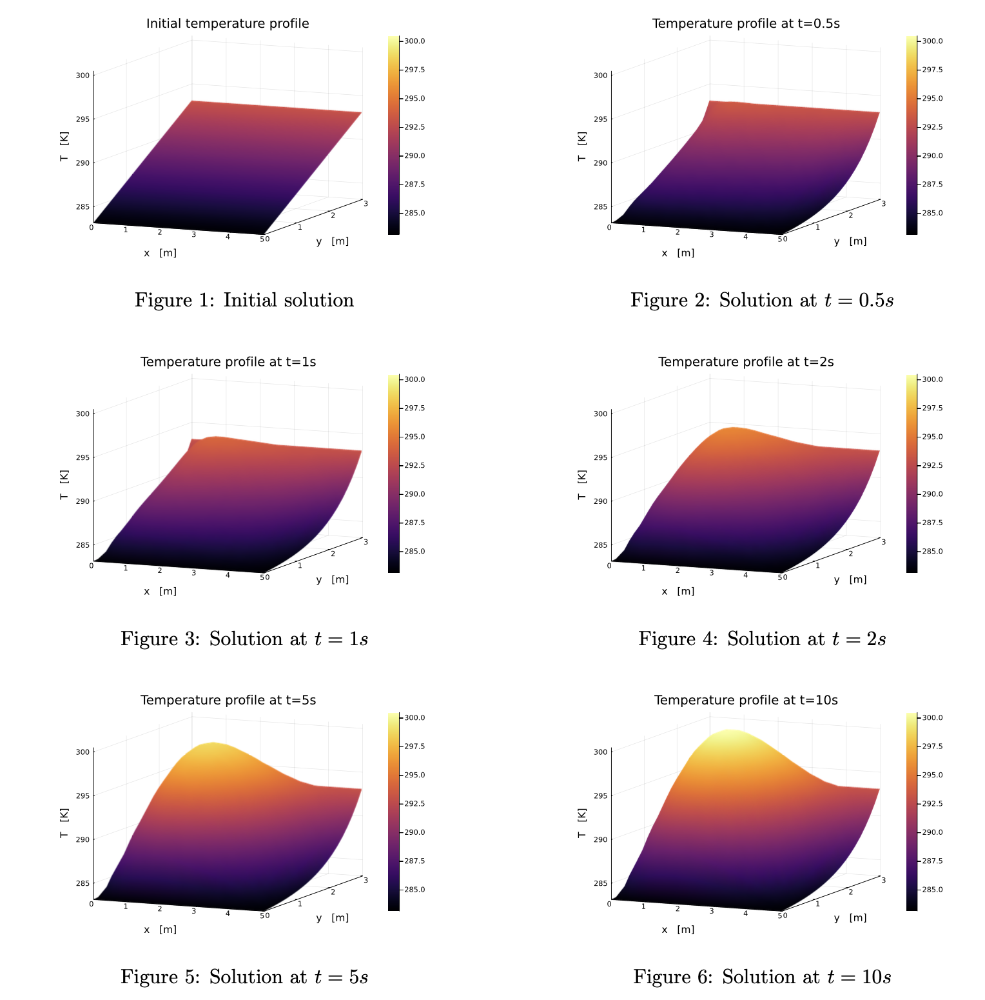

# 2D Diffusion Equation Solver

This project implements a numerical solver for the **two-dimensional diffusion (heat) equation** using a **finite difference method (FDM)** and explicit time-stepping.

## Mathematical Model

We solve the unsteady diffusion equation:

    du/dt = alpha * (d²u/dx² + d²u/dy²)

over a 2D domain Ω with:
- u(x, y, t): temperature or scalar concentration field
- alpha: diffusion coefficient
- Dirichlet or Neumann boundary conditions
- Initial condition: u(x, y, 0) = u₀(x, y)

## Numerical Method

- **Spatial discretization**:
  - Second-order centered finite differences for the Laplacian
  - Uniform Cartesian grid

- **Time discretization**:
  - Forward Euler method
  - Time step constrained by a CFL condition

Update scheme at each grid point (i, j):

    u_new[i,j] = u[i,j] + dt * alpha * (
                   (u[i+1,j] - 2*u[i,j] + u[i-1,j]) / dx² +
                   (u[i,j+1] - 2*u[i,j] + u[i,j-1]) / dy²
                )

## Features

- Supports Dirichlet and Neumann boundary conditions
- Written in modular Python
- Animated and static visualization of the solution
- Sparse matrix Laplacian operator
- Optionally uses LU decomposition (via `scipy.sparse.linalg`) for validation

## Simulation Results

  

The figure shows the evolution of the temperature field at different time steps. The initial heat profile progressively smooths out due to diffusion. It illustrates the physical spreading of heat over time.
